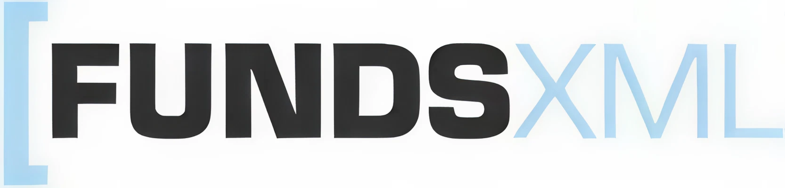

# Chapter 3 — FundsXML — The Standard at a Glance

*History, organisation, and architecture*

---

## 3.1 Setting the Scene: From Syntax to Substance

Chapter 1 made the case for a shared standard. Chapter 2 introduced XML and XSD as the technologies on which such a standard can be built. We now bring those two threads together and ask the obvious next question: *what exactly is FundsXML?*

Return once more to the Europa Growth Fund. After the month-end episode that opened this book, and after a thirty-page crash course in XML, the operations team gathers around a whiteboard for what the head of operations calls a "ten-minute orientation". The team has, by this point, read a number of FundsXML deliveries with a text editor and even run one or two against a schema validator. They can see that the files are well-formed and, mostly, that they are valid. What they still cannot see is the *shape of the thing as a whole*. Where did this schema come from? Who decides what belongs in it and what does not? How are the pieces arranged, and why in that particular way? Unless these questions are answered first, every later chapter of this book will feel like a tour through rooms whose floor plan the reader has never seen.

This chapter is that floor plan. It closes Part I of the book with a deliberately high-altitude view of FundsXML. We tell the story of how the standard came into being and who maintains it today; we distil the design principles that shape every FundsXML message; and we draw a mental map of the five main areas of the schema. No field-level detail appears here — that begins in Chapter 4. The aim is orientation, not completeness: by the end of the chapter the reader should be able to look at any FundsXML document, identify the five main areas, and know which later chapter of this book covers each of them.

By the end of this chapter, you should be able to:

- tell the story of FundsXML from its German origins in 2001 through to the current 4.2.x release of 2026;
- name the bodies and working groups that maintain the standard and explain how a change gets into the schema;
- state the five core design principles that shape every FundsXML delivery;
- draw, from memory, a mental map of the five main schema areas — *ControlData*, *Funds*, *AssetMasterData*, *Documents*, and *RegulatoryReportings* — and recognise how they fit together;
- read a short FundsXML document skeleton on sight and point at the area each part belongs to.

The chapter is built around three questions — *where does FundsXML come from?*, *who runs it?*, and *what does it look like?* — in that order. Readers in a hurry may skim §3.2 and §3.3 and concentrate on §3.4 to §3.6, which are the structural core of the chapter and the foundation for Part II.

---

## 3.2 A Brief History of FundsXML

Standards never arrive out of nowhere. They are always the answer to a concrete industrial problem, and the character of the answer is shaped by the people who formulated the question. FundsXML is no exception. Its story falls naturally into three waves: a German origin phase, a European expansion that crossed national borders, and a regulatory era driven by the wave of EU fund-related legislation of the last decade.

### 3.2.1 Origins: Germany, 2001–2005

FundsXML was created in 2001 by a group of major German-speaking fund-management houses seeking a common format for the fund-data they all had to exchange with one another. The founding participants were **Allianz Global Investment**, **COMINVEST** (later absorbed into Allianz Global Investment), **Credit Suisse Asset Management**, **DEKA**, **DWS**, and **Union Investment**, with early technical support from **Vontobel**, the Swiss software vendor **K&W Software AG**, and **FERI TRUST**. The immediate trigger was neither regulatory nor ideological; it was operational. Each of these houses managed thousands of fund records, and each bilateral channel to a distributor, a depositary, a data vendor, or the financial press used a different CSV layout, a different Excel template, or a different proprietary format. Every new distribution contract added a new mapping, and every mapping had to be maintained forever.

The initial response was pragmatic. A small working group drafted a lightweight XML vocabulary that described the master data and daily price data of a fund, agreed on it informally, and began to use it in production. There was no standards body at first, no formal certification, and no public repository — only a shared schema file, a shared understanding of what the elements meant, and a willingness to keep the format stable for long enough that the investment in implementation would pay off. This informal start left two enduring marks on the standard's character: a preference for practical problem-solving over theoretical elegance, and an instinct for backwards compatibility that has survived every subsequent revision.

The informal phase did not last long. By late 2003, the **BVI** (*Bundesverband Investment und Asset Management e.V.*), the German fund-industry association, had recognised that its members needed a single supported standard for fund-data exchange and formally adopted the effort. **Version 1.0 of FundsXML was published on 8 December 2003** under BVI stewardship. That publication is the moment at which FundsXML ceased to be a private inter-company schema and became a named, versioned industry standard.

### 3.2.2 European Expansion: 2006–2013

The German origin did not stay German for long. Beginning in 2006, the Austrian investment-fund community joined the initiative: **VÖIG** (*Vereinigung Österreichischer Investmentgesellschaften*), the **Oesterreichische Kontrollbank** (OeKB), and **ERSTE-SPARINVEST KAG** brought FundsXML into Austria and established the German-Austrian co-stewardship that still defines the standard's governance today. The chair of the FundsXML Standards Committee is to this day held by BVI, with VÖIG serving as deputy — an arrangement that reflects the order in which the two national communities joined rather than any weighting of their importance.

The pace of European adoption accelerated from there. In **2007**, **Robeco** carried FundsXML into the Netherlands. In **2008**, two further national communities joined simultaneously: **DIAMS** (*FundsXML France*) brought the standard into France, and the **Danish Investment Association IFR** adopted it under the *FundConnect* project for Denmark. The same year, **version 3.0 was published on 30 October 2008**, consolidating several rounds of extensions into a single release. In **2009**, **La Banque Postale Asset Management** of Paris became the first major French adopter. In **2010**, the **AFG** (*Association Française de la Gestion Financière*, the French fund-industry association) endorsed the standard, and **Fundsquare** brought it into Luxembourg. **KNEIP**, also of Luxembourg, followed in **2011**, and **AXA France Investment Managers** in **2012**.

The decisive European moment came in **2013**, when **EFAMA** — the *European Fund and Asset Management Association* — recommended FundsXML as the standard format for the **Fund Processing Passport** (FPP), the pan-European framework for communicating the essential operational data of a fund to its distributors. EFAMA's endorsement moved FundsXML from "a widely-used industry schema" to "the European Fund Association's recommended format", and it placed the standard at the centre of cross-border fund distribution from that point onwards.

### 3.2.3 Regulatory Era and Version 4.x: 2014–2026

The third phase of FundsXML's history is the one most readers of this book will have lived through. Between 2014 and the present, the European fund industry was reshaped by a cascade of regulatory initiatives — MiFID II, PRIIPs, the SFDR and the broader sustainable-finance package, IDD, Solvency II — each of which demanded structured data of a kind that no legacy interface could provide. The FinDatEx consortium, supported by the major European industry associations, responded by publishing a series of templates: the *European MiFID Template* (EMT), the *European PRIIPs Template* (EPT), the *European ESG Template* (EET), the *European Feedback Template* (EFT), and the *Tripartite Template* (TPT) for Solvency II. These templates solved the semantic problem — *which fields must be exchanged and with what meaning* — but they said little about how the fields should travel between systems.

FundsXML became the natural carrier. The major architectural opportunity to make it so was the **4.0.0 release in 2017** — the first release since the original drafting that was deliberately *not* backward-compatible with earlier versions. Version 4.0 re-thought the top-level structure, introduced the separation of static and dynamic fund data that the standard still uses today, and cleaned up a number of historical compromises that had accumulated through the 3.x line. Subsequent 4.x releases then absorbed the FinDatEx templates one after another into the *RegulatoryReportings* area of the schema, so that a single FundsXML delivery could transport the classical master data, the portfolio, the transactions, and the regulatory templates in one envelope. This simple architectural decision — *same envelope, different freights* — is the reason FundsXML has become, in practice, the de-facto European interchange format for structured fund data.

The 4.2 line, first released in May 2022 as version 4.2.0, consolidated this approach and added the connections to the European Single Access Point (ESAP) that Chapter 8 will discuss in detail. Eleven minor releases (4.2.0 through 4.2.10) have followed between 2022 and early 2026, each adding fields, tightening constraints, or tracking new FinDatEx template versions — without breaking the instance documents that earlier releases produced. The book you are holding describes the 4.2.x line and is accurate as of version 4.2.10.

**Table 3.1 — Key Milestones in the History of FundsXML**

| Year | Event | Significance |
|---|---|---|
| 2001 | FundsXML created by Allianz Global Investment, COMINVEST, Credit Suisse Asset Management, DEKA, DWS, and Union Investment; early support from Vontobel, K&W Software AG, and FERI TRUST | Birth of the standard as a private inter-company schema among major German-speaking fund houses |
| 2003 | BVI adopts the standard; Version 1.0 published on 8 December 2003 | Transition from a private schema to a named industry standard under German fund-association stewardship |
| 2006 | VÖIG, OeKB, and ERSTE-SPARINVEST bring FundsXML into Austria | Establishment of the German-Austrian co-stewardship that still defines governance today |
| 2007 | Robeco adopts FundsXML in the Netherlands | First expansion beyond German-speaking Europe |
| 2008 | DIAMS (*FundsXML France*) and the Danish Investment Association IFR (*FundConnect*) adopt the standard; Version 3.0 released on 30 October 2008 | Simultaneous entry into France and Denmark; first major consolidating release |
| 2009 | La Banque Postale Asset Management adopts the standard | First major French asset-management adopter |
| 2010 | AFG endorses FundsXML; Fundsquare adopts it in Luxembourg | Endorsement by the French fund-industry association; entry into Luxembourg |
| 2011 | KNEIP adopts the standard in Luxembourg | Expansion within the Luxembourg fund-services ecosystem |
| 2012 | AXA France Investment Managers adopts the standard | Further French adoption |
| 2013 | EFAMA recommends FundsXML as the standard format for the Fund Processing Passport (FPP) | Recognition as the European Fund Association's recommended fund-data format |
| 2017 | FundsXML 4.0.0 released | First major architectural reset; deliberately not backward-compatible; introduces the static/dynamic separation |
| 2022 | FundsXML 4.2.0 released (4 May 2022) | Current major line; consolidated FinDatEx template integration and ESAP preparation |
| 2026 | Current 4.2.10 line | The version this book describes |

Two final observations on the history are worth keeping in mind. First, FundsXML did *not* originate in Brussels. It was not imposed on the industry by a regulator, nor designed in a policy vacuum by a standards body with no operational stake. It grew out of the day-to-day practice of fund operations teams in six of Germany's largest asset-management houses in 2001, was picked up and formalised by their industry association (BVI) in 2003, and was extended into Austria, the Netherlands, France, Denmark, and Luxembourg over the following decade. This bottom-up genealogy explains a great deal about the standard's character: it is pragmatic, it is extensible, and it is, sometimes, a little idiosyncratic in places where a top-down design would have been tidier.

Second, the standard's evolution has been strictly additive for most of its recent history. Since the 4.0 reset, no subsequent release has broken existing instance documents in a way that required users to rewrite their producers or consumers; new modules have been added, old modules have been extended, and deprecated constructs have been retained alongside their replacements for several release cycles before removal. This conservative release discipline is another reason FundsXML has survived while less patient projects have not.

---

## 3.3 The Organisation Behind the Standard

A living standard needs a living organisation. The question every new FundsXML user eventually asks is *who decides?* — who decides what goes into the next release, who decides when that release is cut, and who the reader should contact if something in the schema is wrong. This section answers those questions in four short subsections.

### 3.3.1 The FundsXML Association

FundsXML is maintained by a registered, not-for-profit industry association whose members are drawn from every role in the European fund value chain: asset managers, fund administrators, depositary banks, data vendors, software houses, and a small number of consultancies. Membership is open, contributions are voluntary, and decisions are taken transparently within the working groups and formalised by the FundsXML Standards Committee (FSC). No single vendor or jurisdiction owns the standard, and no commercial license is required to implement it — both the schema and its documentation are freely available.

This governance model matters in practice. It means that a fund house in Warsaw or Helsinki can join a working group on equal terms with a depositary bank in Frankfurt; it means that a software vendor building a FundsXML parser does not need to negotiate redistribution rights; and it means that the standard's future direction is determined by the people who use it in production, rather than by a committee detached from the operational reality.

### 3.3.2 Working Groups and the Release Cycle

Strategic direction and maintenance of the standard are the responsibility of the **FundsXML Standards Committee (FSC)**, whose members are drawn from thirteen leading fund-industry organisations across Austria, Denmark, France, Germany, Luxembourg, the Netherlands, and Switzerland. The FSC decides on new memberships, creates and dissolves working groups, and — critically — decides on the release and realisation of working-group results. Day-to-day standardisation work is delegated to three dedicated working groups, summarised in Table 3.2.

**Table 3.2 — FundsXML Working Groups**

| Working group | Scope | Typical outputs |
|---|---|---|
| Content & Technique | Manages the XML schema, defines data structures, ensures robustness and consistency of the standard | Schema releases, data-structure definitions |
| Promotion | Visibility and adoption of FundsXML across Europe through marketing, public relations, and member engagement | Conferences, outreach material, adoption campaigns |
| Documentation | Implementation guides, code examples, and schema references | Published guides, sample files, reference documentation |

The release cycle follows the familiar semantic pattern. *Patch* releases within a 4.2.x line contain clarifications, documentation fixes, and strictly non-breaking adjustments — existing instance documents continue to validate unchanged. *Minor* releases (4.2, 4.3, and so on) add new elements or new modules but preserve backwards compatibility for anything that was already present. *Major* releases (the next of which would be 5.0) are reserved for architectural changes that cannot be made compatibly, and the association's policy is to avoid them unless no alternative exists — the 4.x line is now more than fifteen years old, which is a deliberate commitment rather than an accident.

The path a change takes from proposal to release is straightforward. Any member may raise a change request in the relevant working group. The Content & Technique working group discusses it, refines it, and — if the change is substantive — produces a draft schema update together with test files and a short rationale. The draft is then circulated to all members for review, adjusted in response to comments, and, if accepted by the FSC, scheduled into a release window. A release window is announced in advance so that implementers can plan their own update cycles; the release itself ships the new schema, a changelog, updated sample files, and any new or updated validation rules together as a single coordinated package.

### 3.3.3 Where the Standard Lives

FundsXML is, from a technical point of view, a small number of files: the XSD schemas, a collection of sample documents, a changelog, and supporting documentation. All of these are published openly. The authoritative home of the standard is the official website and the associated public source-code repository, where each release is tagged, signed, and accompanied by release notes. The issue tracker on the same repository is the canonical place to report bugs, request clarifications, or propose changes that are not yet mature enough for a working-group agenda.

This book deliberately does not print URLs in the running text; software and infrastructure change faster than books do. Appendix E collects the current set of official links, and the reader is encouraged to treat that appendix as the authoritative pointer whenever the present chapter says "the official site" or "the public repository".

### 3.3.4 Community and Events

Beyond the formal machinery of working groups and releases, FundsXML has a small but active community of practitioners who exchange knowledge at workshops, industry conferences, and informal meet-ups. Training material, webinars, and hands-on sessions are organised by the association itself and occasionally by member firms. For most readers of this book, the relevant point is simply that help exists and is reachable: a question asked in the right place usually receives a reasoned answer from someone who has already solved the same problem in production.

Taken together, the association, the working groups, the public repository, and the community form a lightweight but functional ecosystem. FundsXML is not a finished document to be consumed; it is a living project to which any serious implementer can, and occasionally should, contribute.

---

## 3.4 Design Principles

Before we turn to the schema itself, we pause to name the five principles that shape it. None of them is unique to FundsXML — every mature data standard wrestles with the same trade-offs — but the particular combination is characteristic, and recognising the principles in advance makes the structure of the schema considerably easier to read. These five principles reappear, explicitly or implicitly, in every chapter of Part II.

1. **Separation of static and dynamic data.** FundsXML distinguishes the information about a fund that rarely changes — its name, its ISIN, its domicile, its investment policy — from the information that changes every valuation day — its NAV, its portfolio composition, its transaction flow. The two are carried in different substructures of the same Fund element, which allows a producer to ship a lean daily delta without re-transmitting the entire static record and allows a consumer to cache the static part between deliveries. This principle is visible in the schema as the pairing of *FundStaticData* and *FundDynamicData*, which Chapter 5 explores in detail.

2. **Linkage by UniqueID, not by nesting.** A fund's portfolio may reference hundreds of distinct instruments, and a single instrument — say, a blue-chip European equity — may appear in the portfolios of many funds within the same delivery. Rather than repeat the full description of that instrument at every position where it occurs, FundsXML places each instrument once in a central *AssetMasterData* section and refers to it from every portfolio position by a *UniqueID*. The effect is to normalise the document, much as a relational database normalises a schema: the same information lives in one place and is referenced from wherever it is needed.

3. **Extensibility through CustomAttributes.** No standard can enumerate every field that every member firm, in every jurisdiction, will ever need. FundsXML acknowledges this openly by providing a schema-sanctioned extension mechanism — the `CustomAttributes` element — that allows a producer to attach named key–value data to most structural elements without breaking the schema. National specialties, proprietary risk metrics, internal reference codes, and early experiments with new fields all live here without forcing a fork of the schema. Chapter 9 treats `CustomAttributes` in depth and explains how to use it responsibly.

4. **Multi-language by design.** European fund distribution is inherently multilingual: the same fund may be sold in eleven countries under the same ISIN with eleven different marketing names and eleven versions of the same investment-policy description. FundsXML treats language as a first-class attribute of textual fields, so that a single delivery can carry names, classifications, and descriptions in several languages in parallel. There is no need to produce a separate file per language or to pick a canonical translation at the producer and hope the consumer accepts it.

5. **Modular regulatory carriers.** EMT, EPT, EET, EFT, and TPT each have their own semantics, their own release cadence, and their own community. FundsXML does not attempt to rewrite them; it embeds them as self-contained modules within a *RegulatoryReportings* area, so that each can evolve on its own schedule while travelling in the same envelope as the core fund data. The envelope is stable; the freights are allowed to change independently.

These five principles are the mental scaffolding on which the rest of the book rests. When, in a later chapter, a piece of the schema looks surprising, ask which of the principles it serves: nine times out of ten, the answer explains the design.

---

## 3.5 Schema Architecture at a Glance

We are now ready to look at the shape of FundsXML itself. This section is deliberately a *map*, not a tutorial. For each main area we give the purpose, the kind of content that lives inside it, the single most important idea to carry forward, and a forward pointer to the chapter of this book in which the area is treated in detail. No field listings, no code samples, no XPath expressions — those start in Chapter 4.

A FundsXML document has a single root element, conventionally named [*FundsXML4*](https://fundsxml.github.io/index.html?xpath=/FundsXML4), and beneath that root live five main areas. These areas are the subject of Chapters 4 to 9. Figure 3.1 shows them schematically.

**Figure 3.1 — The Five Main Areas of a FundsXML Document**

```
                             ┌─────────────────┐
                             │    FundsXML4    │  (root)
                             └────────┬────────┘
                                      │
       ┌─────────────┬────────────────┼─────────────────┬───────────────────┐
       │             │                │                 │                   │
┌──────┴──────┐ ┌────┴─────┐ ┌────────┴────────┐ ┌──────┴──────┐ ┌──────────┴───────────┐
│ ControlData │ │  Funds   │ │ AssetMasterData │ │  Documents  │ │ RegulatoryReportings │
│ (envelope)  │ │ (subject │ │  (reference     │ │ (factsheets │ │  (EMT/EPT/EET/…)     │
│             │ │  of msg) │ │   library)      │ │  & signed   │ │                      │
│             │ │          │ │                 │ │  attach.)   │ │                      │
└─────────────┘ └────┬─────┘ └────────▲────────┘ └─────────────┘ └──────────────────────┘
                     │                │
                     │ Portfolio      │ UniqueID
                     │ positions ─────┘ reference
                     │
                     └── Transactions (inside FundDynamicData)
```

The diagram makes two points worth stating in words. First, *Portfolios* and *Transactions* are not siblings of the five main areas; they live *inside* the Funds area, more precisely inside each Fund's *FundDynamicData*. Newcomers often expect Portfolio and Transactions as top-level root children and are briefly disoriented when they are not — remembering their position inside Funds saves a surprising amount of confusion later. Second, the arrow from Portfolio positions up into AssetMasterData is the graphical form of design principle 2: a position does not carry its own asset description; it references one, by UniqueID, in the central library.

We now walk through each of the five areas in the order a reader encounters them in a real delivery.

### 3.5.1 ControlData — The Envelope

[*ControlData*](https://fundsxml.github.io/index.html?xpath=/FundsXML4/ControlData) is the envelope of every FundsXML delivery. It carries the metadata *about* the message rather than the substance *within* it: a unique document identifier, the reporting date to which the delivery refers, the creation timestamp, the identity of the data sender and the intended receiver, the language of the delivery, and — crucially — the *DataOperation* flag that tells the consumer whether the file represents an initial load, an update to a previous delivery, or a deletion. Every FundsXML document contains exactly one ControlData element, and every downstream system reads it first.

The importance of ControlData is disproportionate to its size. It is the piece that allows a consumer to recognise, route, de-duplicate, and sequence a delivery; without it, the same file arriving twice would be indistinguishable from a genuine update, and a delivery arriving out of order would be impossible to reconcile against earlier ones. Chapter 4 walks through ControlData field by field and builds a complete, schema-valid example for the Europa Growth Fund.

### 3.5.2 Funds — The Subject of the Message

[*Funds*](https://fundsxml.github.io/index.html?xpath=/FundsXML4/Funds) is the area that most readers think of as "the FundsXML content proper". It contains one or more *Fund* elements, each representing a single legal fund or sub-fund, and within each Fund the structure splits — following design principle 1 — into [*FundStaticData*](https://fundsxml.github.io/index.html?xpath=/FundsXML4/Funds/Fund/FundStaticData) and [*FundDynamicData*](https://fundsxml.github.io/index.html?xpath=/FundsXML4/Funds/Fund/FundDynamicData). The static part describes the fund's identity: names in multiple languages, identifiers (ISIN, WKN, LEI, Valor), domicile, legal form, share-class structure, investment policy, benchmark, fees. The dynamic part describes the fund on a given valuation date: NAVs per share class, total net assets, performance figures, portfolio composition, and the day's transactions.

Share classes deserve a word here because they often cause the most friction for newcomers. A single fund in FundsXML may carry several share classes, each with its own ISIN, its own currency, its own distribution policy, and its own NAV; the fund's portfolio is typically shared across all share classes, while some of the dynamic figures are per-share-class. Chapter 5 is devoted entirely to the Funds area and uses the Europa Growth Fund, its three share classes, and their daily updates as a continuous example.

### 3.5.3 AssetMasterData — The Reference Library

[*AssetMasterData*](https://fundsxml.github.io/index.html?xpath=/FundsXML4/AssetMasterData) is the central reference library of a FundsXML delivery. It contains one entry per distinct instrument referenced anywhere in the delivery's portfolios, independent of how many times that instrument appears and in how many funds. Each entry gives the full static description of the instrument — asset class, identifiers, issuer, maturity where applicable, classification — and exposes a *UniqueID* by which portfolio positions can refer to it.

The value of AssetMasterData is exactly the value of normalisation in any database: the same information lives in one place, not many, and changes to an instrument's description need to be made once per delivery rather than hundreds of times per portfolio. The principle is important enough that Chapter 6 begins with a section on normalised referencing before it addresses individual asset classes.

### 3.5.4 Documents — Factsheets and Attachments

[*Documents*](https://fundsxml.github.io/index.html?xpath=/FundsXML4/Documents) is the area of the schema that most practitioners meet last, if at all, and yet it fills a surprisingly important role. It carries references to — or, in some deployments, the actual binary content of — fund-related documents that travel alongside the structured data: factsheets, prospectuses, key information documents (KIDs and KIIDs), sustainability-related disclosures, and audit reports. A *Document* entry names the document, classifies it, identifies the language and the effective date, and provides either a URL or an embedded representation.

The Documents area is also where FundsXML's support for XML digital signatures (XMLDSig) is rooted: a signed Document entry allows the producer to attest to the integrity and origin of an attached PDF in a way that survives transport through intermediate systems. Chapter 9 covers the Documents area together with signatures and country-specific additions.

### 3.5.5 RegulatoryReportings — The Regulatory Carriers

[*RegulatoryReportings*](https://fundsxml.github.io/index.html?xpath=/FundsXML4/RegulatoryReportings) is the area into which FundsXML absorbs the FinDatEx templates and related regulatory deliverables. It is organised as a container of self-contained modules, one per template: an *EMT* module for the European MiFID Template, an *EPT* for the PRIIPs template, an *EET* for the ESG template, an *EFT* for the Feedback template, and a *TPT* for the Solvency II Tripartite Template. Each module carries the fields that its template defines, with the same field names and the same data types, so that a FundsXML-aware consumer and a native template-aware consumer see the same data.

The architectural trick — and design principle 5 at work — is that FundsXML does not attempt to *replace* the templates. It carries them. When a template is revised by FinDatEx, the corresponding FundsXML module is updated in the next minor release without disturbing anything else in the delivery. Chapter 8 is the longest chapter in this book precisely because the regulatory carriers are where most of the day-to-day implementation effort goes.

### A Summary Table

**Table 3.3 — The Five Main Areas of FundsXML at a Glance**

| Area | Purpose in one sentence | Treated in |
|---|---|---|
| [ControlData](https://fundsxml.github.io/index.html?xpath=/FundsXML4/ControlData) | Metadata of the delivery: who, when, for whom, which operation | Chapter 4 |
| [Funds](https://fundsxml.github.io/index.html?xpath=/FundsXML4/Funds) | Static and dynamic fund data, share classes, portfolios, transactions | Chapters 5, 6, 7 |
| [AssetMasterData](https://fundsxml.github.io/index.html?xpath=/FundsXML4/AssetMasterData) | Central reference library of instruments, addressed by UniqueID | Chapter 6 |
| [Documents](https://fundsxml.github.io/index.html?xpath=/FundsXML4/Documents) | Factsheets, prospectuses, signed attachments | Chapter 9 |
| [RegulatoryReportings](https://fundsxml.github.io/index.html?xpath=/FundsXML4/RegulatoryReportings) | EMT, EPT, EET, EFT, TPT as self-contained modules | Chapter 8 |

Table 3.3 is the single most important piece of Chapter 3 to keep within reach while reading the rest of the book. Whenever a later chapter refers to a "section" or a "module" of FundsXML, the table tells the reader where it sits in the overall picture.

---

## 3.6 A First FundsXML Skeleton

We close the architectural tour with the first real FundsXML fragment of the book. The listing below is a *skeleton*: it contains the element names and the hierarchy, but no values, no attributes beyond the namespace declaration, and no data beyond what is needed to show how the pieces fit together. No FundsXML validator would accept it, and no system would consume it. Its purpose is orientation, not execution.

```xml
<?xml version="1.0" encoding="UTF-8"?>
<FundsXML4 xmlns:xsi="http://www.w3.org/2001/XMLSchema-instance"
           xsi:noNamespaceSchemaLocation="FundsXML4.xsd">

  <ControlData>
    <!-- document id, reporting date, sender, receiver, operation -->
  </ControlData>

  <Funds>
    <Fund>
      <FundStaticData>
        <!-- names, identifiers, domicile, share classes (static) -->
      </FundStaticData>
      <FundDynamicData>
        <TotalAssetValues>
          <!-- NAVs and total net assets per share class -->
        </TotalAssetValues>
        <Portfolios>
          <Portfolio>
            <Positions>
              <Position>
                <!-- references AssetMasterData by UniqueID -->
              </Position>
            </Positions>
          </Portfolio>
        </Portfolios>
        <SingleFundFlows>
          <!-- transactions: subscriptions, redemptions, distributions -->
        </SingleFundFlows>
      </FundDynamicData>
    </Fund>
  </Funds>

  <AssetMasterData>
    <Asset>
      <!-- one entry per distinct instrument, addressed by UniqueID -->
    </Asset>
  </AssetMasterData>

  <Documents>
    <!-- factsheets, prospectuses, KIDs, signed attachments -->
  </Documents>

  <RegulatoryReportings>
    <!-- EMT / EPT / EET / EFT / TPT modules -->
  </RegulatoryReportings>

</FundsXML4>
```

Even though the listing carries no real data, every design principle from §3.4 is visible in it. Principle 1 — the separation of static and dynamic data — appears as the pairing of *FundStaticData* and *FundDynamicData* inside the Fund element. Principle 2 — linkage by UniqueID — is the reason *Positions* holds only references and not instrument details, while the full instrument descriptions live once, in *AssetMasterData*, at the root level. Principle 3 — extensibility — is not printed above (we have left `CustomAttributes` out of the skeleton deliberately), but every major structural element in the real schema admits it. Principle 4 — multi-language support — is invisible in a skeleton without values, but the name and description fields inside *FundStaticData* will accept per-language variants when we fill them in. And principle 5 — modular regulatory carriers — is the reason *RegulatoryReportings* sits as its own top-level area alongside, rather than inside, the fund data it complements.

This is the last time in the book that a FundsXML sample will be this abstract. Beginning in Chapter 4, every listing carries real data for the Europa Growth Fund. Readers should note that the code listings in Chapters 4 through 8 are **illustrative**: element names, attribute values, and the precise field ordering are written for pedagogical clarity and do not always match the production schema down to the last character. Chapter 9 changes the rule and shows fully **schema-validated** examples against the current FundsXML 4.2.8 XSD, together with the `xmllint` commands that verify them. The complete, end-to-end example for the Europa Growth Fund is printed in Appendix D.

---

## 3.7 Key Takeaways

- FundsXML is not a regulatory imposition but a bottom-up industry standard. It was created in 2001 by six major German-speaking fund-management houses, adopted by BVI in 2003 (version 1.0 published on 8 December 2003), extended into Austria in 2006 under VÖIG, and expanded across Europe over the following decade. Today it is the de-facto European interchange format for structured fund data.
- The standard is maintained by an open, not-for-profit association whose working groups make decisions transparently and whose release discipline has kept the 4.x line backwards-compatible for more than fifteen years.
- Five design principles shape every FundsXML message: the separation of static and dynamic data, linkage by UniqueID rather than nesting, extensibility through `CustomAttributes`, multi-language support as a first-class feature, and modular regulatory carriers inside a stable envelope.
- A FundsXML document has one root and five main areas: *ControlData* (the envelope), *Funds* (the subject of the message), *AssetMasterData* (the reference library), *Documents* (factsheets and signed attachments), and *RegulatoryReportings* (EMT, EPT, EET, EFT, and TPT).
- *Portfolios* and *Transactions* are not top-level areas in their own right; they live inside each Fund's *FundDynamicData*. Positions reference AssetMasterData entries by UniqueID rather than repeating instrument details in place.
- Table 3.3 maps each of the five main areas to the chapter of this book that treats it in depth, and the reader may usefully keep it within reach while reading Part II.

With the map of the standard now in hand, we can zoom in on the first of the five areas — the envelope that every FundsXML delivery begins with. Chapter 4 turns to *ControlData* and walks through every field that identifies, dates, and routes a delivery in production.
